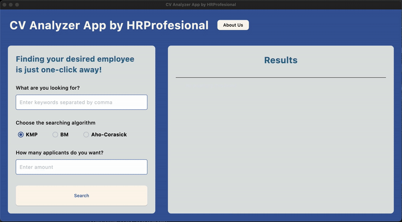

<div align="center">
    <h1>HRProfesional</h1>
    <h2>Tugas Besar 3 IF2211 Strategi Algoritma</h2>




</div>

## Table of Contents
- [Program Description](#program-description)
  - [Fitur Utama](#fitur-utama)
  - [Fitur Bonus](#fitur-bonus)
- [Spesifikasi Sistem](#spesifikasi-sistem)
- [Getting Started: Requirement dan Instalasi](#getting-started-requirement-dan-instalasi)
  - [1. Wajib Menggunakan WSL untuk Pengguna Windows](#1-wajib-menggunakan-wsl-untuk-pengguna-windows)
  - [2. Clone Repository GitHub](#2clone-repository-github)
  - [3. Compile dan Run Program dengan Makefile](#3-compile-dan-run-program-dengan-makefile)
- [Authors](#authors)

---

## Program Description
**HRProfesional** adalah _CV manager_ sederhana berbasis python dengan berbagai algoritma string matching untuk memudahkan pengguna mencari file CV sesuai keinginan.

### Fitur Utama

- Exact keyword Searching (`non-typo words`)
- Fuzzy keyword Searching (`words with typo`)
- KMP and Boyer-Moore Algorithms for pattern matching

### Fitur Bonus
- Aho-Corasick Algorithm for multiple keywords pattern matching

---
## Spesifikasi Sistem

### Persyaratan
- Python 3.12 atau lebih baru
- MySQL Server 8.0 atau lebih baru
- OS: Windows, macOS, atau Linux

### Instalasi Dependensi
1. Pastikan Python dan pip sudah terpasang di sistem.
2. Buka terminal/command prompt di folder proyek ini.
3. Jalankan perintah berikut:

   ```sh
   pip install -r requirements.txt
   ```

4. Pastikan MySQL Server sudah berjalan sebelum menjalankan aplikasi.

Jika Anda menggunakan virtual environment (direkomendasikan):

```sh
python -m venv venv
source venv/bin/activate  # Untuk macOS/Linux
venv\Scripts\activate    # Untuk Windows
pip install -r requirements.txt
```

Jika ada masalah instalasi, pastikan pip sudah ter-update:

```sh
python -m pip install --upgrade pip
```

### Cara Menjalankan Program
Setelah semua dependensi terinstal dan MySQL Server sudah berjalan, jalankan aplikasi dengan perintah berikut di terminal (baik di macOS maupun Windows):

```sh
python run_app.py
```

Pastikan Anda berada di folder utama proyek saat menjalankan perintah di atas.

---
## Authors

| Nama                     | NIM      |
| ------------------------ | -------- |
| Maheswara Bayu Kaindra | 13523015 |
| Mayla Yaffa Ludmilla | 13523050 |
| Angelina Efrina Prahastaputri | 13523060 |